# CYDrip

Монитор глюкозы на базе ESP32-2432S028 ("Cheap Yellow Display").

Получает данные с CGM через Android-приложение CYDDrip по BLE и отображает их на встроенном 2.8" дисплее. Может также подключаться напрямую к Nightscout через WiFi.



## Возможности

- Текущий уровень глюкозы с цветовой индикацией (зелёный / жёлтый / красный)
- Стрелка тренда
- Мини-график за последние 3 часа (36 точек × 5 мин)
- Delta между последними двумя показаниями
- IoB, CoB, последний болюс, данные помпы
- Текущее местное время (BLE-синхронизация или NTP)
- Звуковые тревоги при выходе за пороги (через динамик CN1)
- **Два режима ориентации** — landscape (по умолчанию) и portrait; переключение долгим нажатием кнопки или через `CYD.INI`
- Регулировка яркости коротким нажатием кнопки
- Сохранение истории и ориентации в NVS (переживает перезагрузку)
- **Веб-интерфейс настройки** — поднимает точку доступа при старте
- Конфигурация через `CYD.INI` на SD-карте (переопределяет веб-настройки)
- WiFi + прямое подключение к Nightscout (альтернатива BLE)
- NTP синхронизация времени при наличии WiFi

## Железо

| Компонент | Описание |
|-----------|----------|
| Плата | ESP32-2432S028 (CYD) |
| Дисплей | ILI9341 2.8" 320×240 (встроен) |
| Динамик | 8Ω 0.5W, JST 1.25mm 2-pin → CN1 |
| Кнопка яркости / ориентации | Тактовая 6×6mm → P3 GPIO 27 + GND |
| Кнопка сброса тревоги | Тактовая 6×6mm → P3 GPIO 22 + GND |
| SD-карта | FAT32, microSD → встроенный слот (опционально) |

Подробная распиновка и схемы подключения: [docs/HARDWARE.md](docs/HARDWARE.md)

## Сборка

Проект на [PlatformIO](https://platformio.org/).

```bash
pio run --target upload
```

Все настройки TFT_eSPI заданы через `build_flags` в `platformio.ini` — файл `User_Setup.h` не нужен.

## Конфигурация

### Через веб-интерфейс (рекомендуется)

При каждом старте устройство поднимает точку доступа **`CYDrip-Setup`** (без пароля) на 3 минуты.

1. Подключись к WiFi сети `CYDrip-Setup`
2. Открой в браузере **`192.168.4.1`**
3. Заполни поля и нажми **Save and Reboot**

Настройки сохраняются во внутреннюю память (NVS) и переживают перезагрузку без SD-карты.

| Поле | Описание |
|------|----------|
| WiFi SSID / Password | Домашняя сеть для подключения к Nightscout и NTP |
| Nightscout URL | Например `https://mysite.ns.io` |
| Nightscout Token | Токен доступа (если настроен) |
| NTP Server | Сервер времени, по умолчанию `pool.ntp.org` |

После закрытия AP (через 3 мин):
- **WiFi подключён** → точка доступа выключается, веб-интерфейс остаётся доступен по локальному IP
- **WiFi не настроен** → WiFi полностью выключается, устройство работает в режиме BLE

### Через SD-карту (расширенная конфигурация)

Создай файл `CYD.INI` в корне SD-карты. Параметры из файла переопределяют веб-настройки.

```ini
[config]
show_mgdl=0          ; 0 = mmol/L, 1 = mg/dL
utc_offset_min=180   ; UTC+3 (Москва). Приоритет над значением из BLE-пакета. При наличии WiFi — NTP перекрывает всё
ntp_server=pool.ntp.org
bg_low=3.9
bg_warn_low=4.5
bg_warn_high=9.0
bg_high=10.0
brightness=2         ; 0=тускло, 1=средне, 2=ярко
rotation=0           ; 0=landscape (умолч.), 1=portrait. Если не задан — используется последнее значение, сохранённое кнопкой
; blepassword=secret

[wifi]
ssid=MyNetwork
password=MyPassword

[nightscout]
url=https://mysite.ns.io
; token=mytoken-xxxxxxxx
```

## Кнопки

| Кнопка | Короткое нажатие | Длинное нажатие (≥ 800 мс) |
|--------|-----------------|---------------------------|
| BOOT (GPIO 0, на плате) | Яркость | Переключить ориентацию |
| P3 GPIO 27 (внешняя) | Яркость | Переключить ориентацию |
| P3 GPIO 22 (внешняя) | Сброс тревоги | — |

Выбранная ориентация сохраняется в NVS и восстанавливается при перезагрузке. Параметр `rotation` в `CYD.INI` имеет приоритет над сохранённым значением.

## BLE

Устройство представляется как `M5Stack` для совместимости с приложением CYDDrip.

Протокол: WatchDrip CYD (opcodes 0x09 / 0x0A / 0x20 / 0x21).
Полное описание пакетов: [docs/HARDWARE.md](docs/HARDWARE.md#ble-protocol-watchdrip-cyd)

## Тревоги

| Условие | Сигнал |
|---------|--------|
| BG < `bg_low` или > `bg_high` | 3 коротких писка (срочная) |
| BG < `bg_warn_low` или > `bg_warn_high` | 1 писк (предупреждение) |

Повтор каждые 5 минут. Кнопка сброса (GPIO 22) глушит тревогу до выхода из зоны.

## Лицензия

GPL-3.0. Основано на M5Stack Nightscout monitor by Johan Degraeve.
